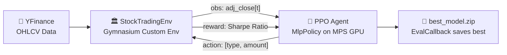
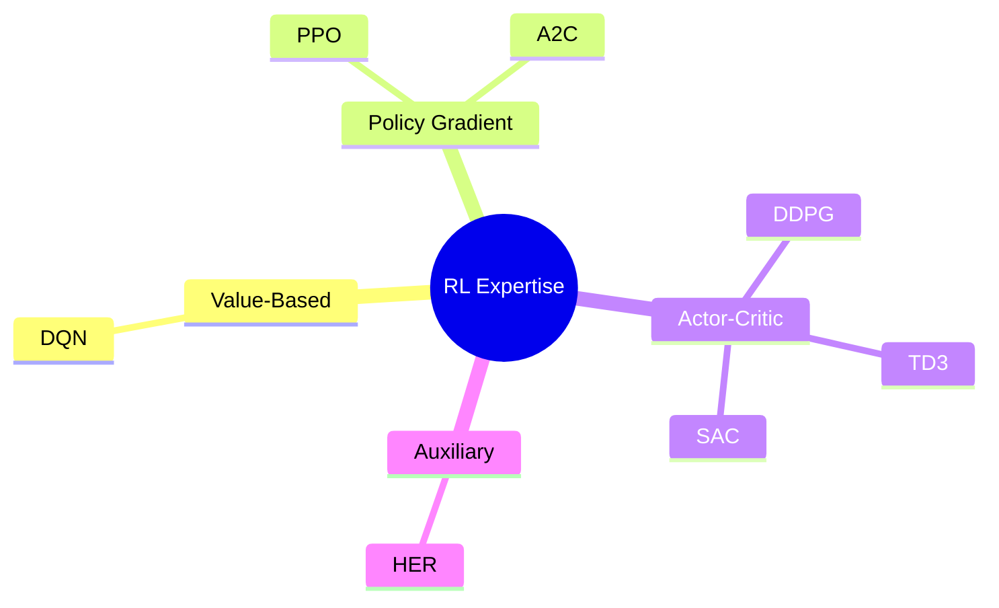
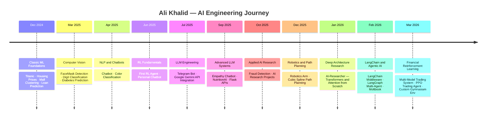

<!-- ═══════════════════════════════════════════════════════════════════════════════
     ALI KHALID — GitHub Profile README
     Designed for: https://github.com/Alouakhalid/Alouakhalid
     ═══════════════════════════════════════════════════════════════════════════════ -->

<div align="center">

<!-- HEADER BANNER — works reliably on GitHub -->


# Ali Khalid &nbsp;|&nbsp; AI Engineer

<p>
  <a href="https://www.linkedin.com/in/ali-khalid-ali-khalid-85468225b/">
    
  </a>&nbsp;
  <a href="https://github.com/Alouakhalid">
    
  </a>&nbsp;
  
</p>

<br/>

</div>

---

## 🧭 About Me

I'm an **AI Engineer & Deep Learning Researcher** with a passion for building end-to-end intelligent systems — from mathematical first principles to production-grade deployments. My work spans reinforcement learning, large language models, computer vision, and financial AI.

```python
profile = {
    "name"       : "Ali Khalid",
    "role"       : "AI Engineer & Deep Learning Researcher",
    "focus"      : ["Reinforcement Learning", "Deep Learning", "LLM Engineering", "FinTech AI"],
    "philosophy" : "Bridge mathematics → architecture → deployment",
    "languages"  : ["Python", "C++", "JavaScript", "MATLAB"],
    "currently"  : "Building autonomous AI trading agents with PPO & custom Gymnasium envs",
    "open_to"    : "Research collaborations, freelance AI projects",
}
```

---

## 📌 Quick Navigation

| Domain | Jump To |
|:---|:---|
| 🚀 Featured Projects | [RL Trading Bot](#-1-rl-stock-trading-agent) · [AI Researcher](#-2-ai-researcher) · [LangChain](#-3-langchain--langgraph-middleware) · [Trading Model](#-4-multi-model-trading-system) |
| 🤖 Skills | [RL Algorithms](#-reinforcement-learning-algorithms) · [Classic ML](#-classic-machine-learning-models) · [Deep Learning](#-deep-learning--neural-architectures) · [HuggingFace](#-hugging-face--pretrained-models) |
| 📊 Stats | [GitHub Stats](#-github-stats) · [Timeline](#-learning-journey--timeline) |

---

## 🔥 Featured Projects

---

### 🤖 1. RL Stock Trading Agent
> **Flagship Project** — Production-grade Deep Reinforcement Learning for autonomous stock trading.

<table>
<tr><td><b>🔗 Repository</b></td><td><a href="https://github.com/Alouakhalid/Trading_bot_Reinforcment">Trading_bot_Reinforcment</a></td></tr>
<tr><td><b>📦 Stack</b></td><td><code>Stable-Baselines3</code> · <code>Gymnasium</code> · <code>PyBroker / YFinance</code> · <code>Apple MPS</code></td></tr>
<tr><td><b>🎯 Reward</b></td><td>Sharpe Ratio (risk-adjusted returns, not raw P&L)</td></tr>
<tr><td><b>📈 Result</b></td><td>Episode reward improved from <code>-1,000 → +1,660</code> during training</td></tr>
</table>

**What makes it special:**
- Custom `StockTradingEnv` — realistic commission `(0.01%)` + slippage `(0.5%)` modeling
- `EvalCallback` + `StopTrainingOnRewardThreshold` for intelligent automated training stops
- Fully compatible with the new **Gymnasium API** (5-tuple `step()` return)
- Best model auto-saved to `Training/Saved Models/best_model.zip`



---

### 🧠 2. AI Researcher
> **6 ⭐** — Research-focused framework for Deep Learning at full mathematical depth.

<table>
<tr><td><b>🔗 Repository</b></td><td><a href="https://github.com/Alouakhalid/AI-Researcher">AI-Researcher</a></td></tr>
<tr><td><b>📦 Stack</b></td><td><code>PyTorch</code> · <code>NumPy</code> · <code>Matplotlib</code></td></tr>
<tr><td><b>⭐ Stars</b></td><td>6</td></tr>
</table>

| Module | Notebook | Depth |
|:---|:---|:---|
| Neural Foundations | `Neural_Netwok.ipynb` | Biological → Mathematical abstraction |
| Attention Mechanisms | `Attention.ipynb` | Multi-Head Self-Attention from scratch |
| Transformer Architecture | `transformation_block.ipynb` | Full encoder/decoder (no `nn.Transformer`) |
| Math Visualizations | `math_pyhton.ipynb` | Gradients, loss landscapes, activations |

> *"If you want to use models → elsewhere. If you want to understand, modify, and design models → welcome."*

---

### 🔗 3. LangChain & LangGraph Middleware
> Advanced LLM middleware pipeline with dynamic model routing and context chaining.

<table>
<tr><td><b>🔗 Repository</b></td><td><a href="https://github.com/Alouakhalid/langchain-and-langgraphe">langchain-and-langgraphe</a></td></tr>
<tr><td><b>📦 Stack</b></td><td><code>LangChain</code> · <code>LangGraph</code> · <code>Ollama</code> · <code>Python</code></td></tr>
</table>

- Middleware-chain pattern for structured context passing between LLM calls
- Dynamic model selection — routes queries to the right model at runtime
- Prompt engineering pipeline with `Dynamic_prompt.py` + `Dynamic_model_chocie.py`
- `langchain3.py` orchestrates the full chain end-to-end

---

### 📊 4. Multi-Model Trading System
> Hybrid quantitative analysis combining Transformer + LSTM + Random Forest for prediction.

<table>
<tr><td><b>🔗 Repository</b></td><td><a href="https://github.com/Alouakhalid/Trading_model">Trading_model</a></td></tr>
<tr><td><b>📦 Stack</b></td><td><code>PyTorch</code> · <code>Scikit-Learn</code> · <code>Flet Dashboard</code> · <code>Plotly</code></td></tr>
</table>

| Model | Role | Features Used |
|:---|:---|:---|
| **Transformer Encoder** | Market regime detection | Multi-Head Attention over OHLCV |
| **LSTM Network** | Price action forecasting | Sequential memory, momentum |
| **Random Forest (200 trees)** | Buy/Sell signal | RSI, MACD, ATR, EMA, SMA |

---

### 🦿 Other Notable Projects

| # | Project | Stack | Description |
|:---:|:---|:---|:---|
| 5 | [Robotics-Arm](https://github.com/Alouakhalid/Robotics-Arm) | Python · NumPy | Robotic arm control & inverse kinematics |
| 6 | [Reinforcement_learning_projects_agents](https://github.com/Alouakhalid/Reinforcement_learning_projects_agents) | SB3 · Gymnasium | Multi-domain RL agent collection |
| 7 | [Empathy-chatbot](https://github.com/Alouakhalid/Empathy-chatbot) | Python · NLP | Emotionally-aware conversational agent |
| 8 | [NutritionAI](https://github.com/Alouakhalid/NutritionAI) | HTML · JS | ⭐ AI-powered nutrition advisor web app |
| 9 | [Fraud-detection](https://github.com/Alouakhalid/Fraud-detection) | XGBoost · ML | Financial fraud detection pipeline |
| 10 | [FaceMask-Project](https://github.com/Alouakhalid/FaceMask-Project) | CNN · OpenCV | Real-time face mask detection |
| 11 | [Moltbook_project](https://github.com/Alouakhalid/Moltbook_project) | HTML · CSS | ⭐ Full-featured web book platform |
| 12 | [Titanic-project-](https://github.com/Alouakhalid/Titanic-project-) | Ensemble ML | ⭐ Titanic survival prediction |
| 13 | [cubic-spline-path-of-robot-](https://github.com/Alouakhalid/cubic-spline-path-of-robot-) | Python | Cubic spline trajectory planning |
| 14 | [document-qa](https://github.com/Alouakhalid/document-qa) | LangChain | PDF & document Q&A system |

<details>
<summary><b>📂 View All 31 Repositories</b></summary>

| Project | Language | Stars | Updated |
|:---|:---|:---:|:---|
| [Trading_bot_Reinforcment](https://github.com/Alouakhalid/Trading_bot_Reinforcment) | Jupyter | — | Mar 2026 |
| [Trading_model](https://github.com/Alouakhalid/Trading_model) | Jupyter | — | Mar 2026 |
| [Reinforcement_learning_notes-](https://github.com/Alouakhalid/Reinforcement_learning_notes-) | Jupyter | — | Mar 2026 |
| [Reinforcement_learning_projects_agents](https://github.com/Alouakhalid/Reinforcement_learning_projects_agents) | Jupyter | — | Mar 2026 |
| [langchain-and-langgraphe](https://github.com/Alouakhalid/langchain-and-langgraphe) | Python | — | Feb 2026 |
| [Moltbook_project](https://github.com/Alouakhalid/Moltbook_project) | HTML | ⭐ 1 | Feb 2026 |
| [AI-Researcher](https://github.com/Alouakhalid/AI-Researcher) | Jupyter | ⭐ 6 | Jan 2026 |
| [Robotics-Arm](https://github.com/Alouakhalid/Robotics-Arm) | Python | — | Dec 2025 |
| [Assiuitsheets_new_comer_solutions](https://github.com/Alouakhalid/Assiuitsheets_new_comer_solutions) | C++ | — | Dec 2025 |
| [AI_research_project-](https://github.com/Alouakhalid/AI_research_project-) | Python | — | Oct 2025 |
| [Fraud-detection](https://github.com/Alouakhalid/Fraud-detection) | Jupyter | — | Oct 2025 |
| [NutritionAI](https://github.com/Alouakhalid/NutritionAI) | HTML | ⭐ 1 | Sep 2025 |
| [flask](https://github.com/Alouakhalid/flask) | Python | — | Sep 2025 |
| [Empathy-chatbot](https://github.com/Alouakhalid/Empathy-chatbot) | Python | — | Sep 2025 |
| [bot](https://github.com/Alouakhalid/bot) | Python | — | Jul 2025 |
| [bot_telegram](https://github.com/Alouakhalid/bot_telegram) | Python | — | Jul 2025 |
| [Reinforcement-Learning-Agent-](https://github.com/Alouakhalid/Reinforcement-Learning-Agent-) | Python | — | Jun 2025 |
| [personal_chatbot](https://github.com/Alouakhalid/personal_chatbot) | Python | — | Jun 2025 |
| [chatbot-with-api_google](https://github.com/Alouakhalid/chatbot-with-api_google) | Python | — | May 2025 |
| [document-qa](https://github.com/Alouakhalid/document-qa) | Python | — | May 2025 |
| [Digit-classification](https://github.com/Alouakhalid/Digit-classification) | Jupyter | — | May 2025 |
| [chatbot](https://github.com/Alouakhalid/chatbot) | Jupyter | — | Apr 2025 |
| [color-classification](https://github.com/Alouakhalid/color-classification) | Jupyter | — | Apr 2025 |
| [FaceMask-Project](https://github.com/Alouakhalid/FaceMask-Project) | Jupyter | — | Apr 2025 |
| [Diabetes-](https://github.com/Alouakhalid/Diabetes-) | Jupyter | — | Mar 2025 |
| [Loan-Prediction-](https://github.com/Alouakhalid/Loan-Prediction-) | Jupyter | — | Dec 2024 |
| [cubic-spline-path-of-robot-](https://github.com/Alouakhalid/cubic-spline-path-of-robot-) | Python | — | Dec 2024 |
| [housing_price_prediction](https://github.com/Alouakhalid/housing_price_prediction) | Jupyter | — | Dec 2024 |
| [Mall-Customers-clustering-](https://github.com/Alouakhalid/Mall-Customers-clustering-) | Jupyter | — | Dec 2024 |
| [Titanic-project-](https://github.com/Alouakhalid/Titanic-project-) | Jupyter | ⭐ 1 | Dec 2024 |

</details>

---

## 🚀 Technical Skills

---

### 🧠 Core AI Domains

<div align="center">


</div>

---

### 💻 Programming Languages

<div align="center">


</div>

---

### 🤖 Reinforcement Learning Algorithms

Experience implementing, tuning, and deploying the following algorithms via **Stable-Baselines3** and from scratch:

| Algorithm | Full Name | Paradigm | Action Space | Key Strength |
| :--- | :--- | :--- | :--- | :--- |
| **DQN** | Deep Q-Network | Value-Based | Discrete | Atari, discrete control |
| **PPO** | Proximal Policy Optimization | Policy Gradient | Both | ⭐ Stable, sample-efficient, production-ready |
| **A2C** | Advantage Actor-Critic | Actor-Critic | Both | Parallel env training |
| **DDPG** | Deep Deterministic Policy Gradient | Actor-Critic | Continuous | Robotics, continuous control |
| **TD3** | Twin Delayed DDPG | Actor-Critic | Continuous | Reduced Q-value overestimation |
| **SAC** | Soft Actor-Critic | Actor-Critic | Continuous | Maximum entropy, sample-efficient |
| **HER** | Hindsight Experience Replay | Auxiliary | Both | Sparse reward environments |



---

### 🌲 Classic Machine Learning

#### 📈 Regression

| Model | Library | Notes |
| :--- | :--- | :--- |
| Linear Regression | `scikit-learn` | Baseline |
| Ridge Regression | `scikit-learn` | L2 regularization |
| Lasso Regression | `scikit-learn` | L1 · feature selection |
| ElasticNet | `scikit-learn` | L1 + L2 combined |
| Polynomial Regression | `scikit-learn` | Non-linear features |
| Support Vector Regression (SVR) | `scikit-learn` | Kernel-based |
| Decision Tree Regressor | `scikit-learn` | Interpretable |
| **Random Forest Regressor** | `scikit-learn` | ⭐ Ensemble bagging |
| Gradient Boosting Regressor | `scikit-learn` | Sequential boosting |
| **XGBoost Regressor** | `xgboost` | ⭐ Optimized GBM |
| LightGBM Regressor | `lightgbm` | Large-scale · fast |
| K-Nearest Neighbors Regressor | `scikit-learn` | Non-parametric |
| Bayesian Ridge | `scikit-learn` | Probabilistic |

#### 🔍 Classification

| Model | Library | Notes |
| :--- | :--- | :--- |
| Logistic Regression | `scikit-learn` | Baseline classifier |
| Support Vector Machine (SVC) | `scikit-learn` | Kernel margin classifier |
| Decision Tree Classifier | `scikit-learn` | Interpretable rules |
| **Random Forest Classifier** | `scikit-learn` | ⭐ 200+ trees ensemble |
| Gradient Boosting Classifier | `scikit-learn` | Sequential learners |
| **XGBoost Classifier** | `xgboost` | ⭐ Competition-grade boosting |
| **LightGBM Classifier** | `lightgbm` | Fast large-scale |
| AdaBoost | `scikit-learn` | Adaptive boosting |
| Naive Bayes (Gaussian / Multinomial) | `scikit-learn` | Probabilistic |
| K-Nearest Neighbors (KNN) | `scikit-learn` | Distance-based |
| Linear Discriminant Analysis (LDA) | `scikit-learn` | Reduce + classify |
| Quadratic Discriminant Analysis (QDA) | `scikit-learn` | Non-linear boundary |
| Extra Trees Classifier | `scikit-learn` | Extremely randomized |
| Multi-Layer Perceptron (MLP) | `scikit-learn` | Neural shallow net |

#### 🔵 Clustering (Unsupervised)

| Model | Key Use |
| :--- | :--- |
| **K-Means** | ⭐ Customer segmentation (Mall project) |
| DBSCAN | Density-based · outlier/anomaly detection |
| Hierarchical / Agglomerative | Dendrogram-based grouping |
| Gaussian Mixture Models (GMM) | Soft probabilistic clustering |
| PCA | Dimensionality reduction |
| t-SNE | High-dim visualization |

---

### ⚡ Deep Learning & Neural Architectures

<div align="center">


</div>

| Architecture | Description | Projects |
| :--- | :--- | :--- |
| **Feedforward (MLP)** | Custom layers, activations, optimizers | Trading, classification |
| **CNN** | Convolution, pooling, BatchNorm | FaceMask, Digit, Color |
| **LSTM / GRU** | Sequential memory, time-series | Trading forecasting |
| **Transformer / Attention** | Multi-Head Self-Attention, positional encoding | AI-Researcher, Trading |
| **Hybrid (Transformer + LSTM + RF)** | Ensemble of deep + classical | Multi-Model Trading System |
| **Autoencoder** | Unsupervised feature learning | Anomaly detection |

---

### 🤗 Hugging Face & Pretrained Models

<div align="center">


</div>

#### 🖼️ Computer Vision — Pretrained Models

| Model | Architecture | Parameters | Key Use Case |
| :--- | :--- | :--- | :--- |
| **VGG-16** | Very Deep Convolution Network | 138M | Image classification, feature extraction |
| **VGG-19** | Deeper VGG | 143M | Fine-tuning for custom datasets |
| **ResNet-50** | Residual Networks (He et al.) | 25M | Transfer learning · skip connections |
| **ResNet-101 / ResNet-152** | Deep Residual | 44M / 60M | High-accuracy recognition |
| **EfficientNet-B0 → B7** | Compound scaling | 5M–66M | ⭐ State-of-art accuracy/efficiency |
| **MobileNetV2 / V3** | Depthwise separable conv | 3–5M | Edge deployment · mobile inference |
| **InceptionV3 / InceptionResNetV2** | Inception modules | 23M / 55M | Multi-scale feature capture |
| **DenseNet-121 / 201** | Dense connections | 8M / 20M | Medical imaging, dense predictions |
| **ViT (Vision Transformer)** | Patch-based Transformer | 86M+ | ⭐ SOTA image classification |
| **CLIP (OpenAI)** | Contrastive vision-language | 400M | Zero-shot image classification |
| **DETR** | Detection Transformer | 41M | Object detection without anchors |

#### 📝 NLP / LLM — Pretrained Models

| Model | Type | Key Use Case |
| :--- | :--- | :--- |
| **BERT / RoBERTa** | Encoder | Text classification, NER, Q&A |
| **GPT-2** | Decoder | Text generation |
| **DistilBERT** | Distilled BERT | Fast inference, mobile NLP |
| **T5 / FLAN-T5** | Encoder-Decoder | Summarization, translation |
| **Llama 2 / 3 (via Ollama)** | Decoder LLM | Local chatbot, reasoning |
| **Mistral (via Ollama)** | Decoder LLM | Fast local inference |
| **Gemini (API)** | Multimodal LLM | Google AI integration |

#### 🔧 HuggingFace Ecosystem

```python
from transformers import pipeline, AutoModelForImageClassification, AutoFeatureExtractor
from torchvision.models import vgg16, resnet50, efficientnet_b0, mobilenet_v3_large

# Transfer Learning workflow
backbone   = vgg16(pretrained=True)           # Load pretrained weights
features   = backbone.features               # Freeze conv layers
classifier = nn.Sequential(nn.Linear(25088, 512), nn.ReLU(), nn.Linear(512, num_classes))

# HuggingFace zero-shot classification
classifier = pipeline("zero-shot-classification", model="facebook/bart-large-mnli")
```

---

### 🔗 LLM & Agentic AI Stack

<div align="center">


</div>

| Tool | Capability |
| :--- | :--- |
| **LangChain** | Middleware chains, prompt templates, context passing, memory |
| **LangGraph** | Stateful multi-agent graph workflows |
| **Ollama** | Local LLM deployment — Llama, Mistral, CodeLlama |
| **Gemini API** | Google multimodal AI integration |
| **HuggingFace Transformers** | Model hub, fine-tuning, inference pipelines |

---

### 🏋️ RL & Scientific Computing Stack

<div align="center">


</div>

---

### 📊 Data Science & Visualization

<div align="center">


</div>

**Core competencies:**
- 📐 **Feature Engineering** — Rolling statistics, RSI, MACD, ATR, volatility signals
- 🧹 **Data Analysis & Cleaning** — Missing value imputation, outlier detection, normalization
- 📉 **Model Evaluation** — Cross-validation, confusion matrices, ROC-AUC, Sharpe Ratio, F1
- 📊 **Visualization** — Interactive dashboards (Plotly / Flet), trade charts, loss/reward curves

---

## 📊 GitHub Stats

<div align="center">

<a href="https://github.com/Alouakhalid">
  
  
</a>

<br/><br/>

<a href="https://github.com/Alouakhalid">
  
</a>

</div>

---

## 🗺️ Learning Journey & Timeline



---

## 🎯 Current Focus

```
🚀  Reinforcement Learning for Algorithmic Trading
    ├── Custom Gymnasium environments with realistic market microstructure
    ├── Sharpe-Ratio reward engineering
    └── PPO / SAC agent training on Apple MPS GPU

🧠  Deep Learning Architecture Research
    ├── Transformer / Attention from mathematical first principles
    └── Building toward architectural design capability (beyond usage)

🤗  Pretrained Model Fine-tuning
    ├── VGG / EfficientNet / ViT transfer learning pipelines
    └── HuggingFace Transformers for NLP downstream tasks

🔗  Agentic LLM Systems
    ├── LangChain middleware design patterns
    └── LangGraph multi-agent orchestration
```

---

<div align="center">

---

**Ali Khalid** &nbsp;·&nbsp; AI Engineer & Deep Learning Researcher

<a href="https://www.linkedin.com/in/ali-khalid-ali-khalid-85468225b/">
  
</a>
&nbsp;
<a href="https://github.com/Alouakhalid">
  
</a>

<br/><br/>

<sub>Built with research-grade precision · Updated March 2026</sub>

</div>
