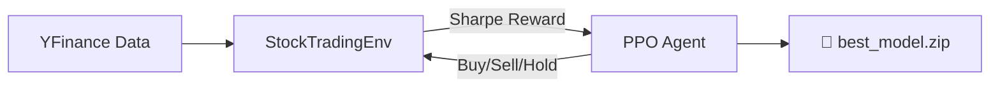
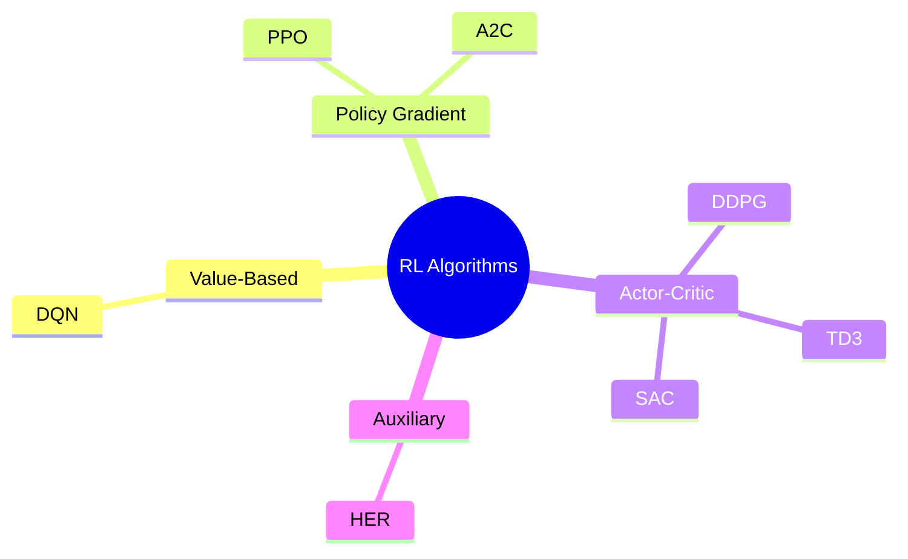
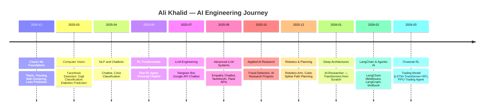

<div align="center">


<p>
  <a href="https://www.linkedin.com/in/ali-khalid-ali-khalid-85468225b/">
    
  </a>
  <a href="https://github.com/Alouakhalid">
    
  </a>
  
</p>

<br/>

> *"Don't just use models. Understand, modify, and design them."*

</div>

---

## 🧭 About Me

I'm an **AI Engineer & Deep Learning Researcher** with a strong foundation in building end-to-end intelligent systems — from mathematical first principles to production-grade deployments. My work spans reinforcement learning, large language models, computer vision, and financial AI.

I don't build demos. I build **research-grade systems** designed to be understood from the ground up.

```python
profile = {
    "name"       : "Ali Khalid",
    "focus"      : ["Reinforcement Learning", "Deep Learning", "LLM Engineering", "Machine Learning"],
    "philosophy" : "Bridge mathematics → architecture → deployment",
    "languages"  : ["Python", "C++", "HTML/JS"],
    "currently"  : "Building autonomous AI trading agents with PPO & custom Gymnasium envs",
}
```

---

## 🔥 Featured Projects

<div align="center">

### 🏆 Ranked by Impact & Complexity

</div>

---

### 🤖 1. RL Stock Trading Agent — *Custom Gymnasium + PPO*
> **The flagship project**: A production-grade Deep Reinforcement Learning system for autonomous stock trading.

| | |
|:---|:---|
| 🔗 **Repo** | [Trading_bot_Reinforcment](https://github.com/Alouakhalid/Trading_bot_Reinforcment) |
| 📦 **Stack** | `Stable-Baselines3` · `Gymnasium` · `PyBroker` · `Apple MPS` |
| ⭐ **Stars** | 0 (active development) |

**What makes it special:**
- Custom `StockTradingEnv` implementing the full Gymnasium API with realistic **commission fees (0.01%)** and **slippage (0.5%)**
- Reward signal engineered as **Sharpe Ratio** (not raw P&L), incentivizing risk-adjusted returns
- `EvalCallback` + `StopTrainingOnRewardThreshold` for smart, automated training stops
- MPS (Apple Metal) GPU acceleration · Episode rewards improved from `-1000 → +1660` during training



---

### 🧠 2. AI Researcher — *Mathematical Deep Learning from Scratch*
> **6 ⭐** — A research-focused framework for understanding AI architectures at mathematical depth.

| | |
|:---|:---|
| 🔗 **Repo** | [AI-Researcher](https://github.com/Alouakhalid/AI-Researcher) |
| 📦 **Stack** | `PyTorch` · `NumPy` · `Matplotlib` |
| ⭐ **Stars** | 6 |

**Modules built from first principles:**
- 🧮 **Neural Foundations** — Biological → Mathematical abstraction of neurons
- ⚡ **Attention Mechanisms** — Multi-Head Self-Attention implemented from scratch
- 🏗️ **Transformer Architecture** — Full encoder/decoder block (no `nn.Transformer`)
- 📐 **Mathematical Visualizations** — Intuition for gradients, loss landscapes, activations

> *"If you want to use models → this is not for you. If you want to understand, modify, and design models → welcome."*

---

### 🧠 3. LangChain & LangGraph Middleware Architecture
> Advanced LLM middleware pipeline with dynamic model routing and context chaining.

| | |
|:---|:---|
| 🔗 **Repo** | [langchain-and-langgraphe](https://github.com/Alouakhalid/langchain-and-langgraphe) |
| 📦 **Stack** | `LangChain` · `LangGraph` · `Ollama` · `Python` |

**Architecture highlights:**
- Middleware-chain pattern for context passing between LLM calls
- Dynamic model selection logic — routes queries to different models at runtime
- Prompt engineering pipeline with `Dynamic_prompt.py` and `Dynamic_model_chocie.py`
- Clean separation: `langchain3.py` orchestrates the full chain end-to-end

---

### 📊 4. Multi-Model Trading System — *Transformer + LSTM + Random Forest*
> A hybrid quantitative analysis system combining three model families for stock direction prediction.

| | |
|:---|:---|
| 🔗 **Repo** | [Trading_model](https://github.com/Alouakhalid/Trading_model) |
| 📦 **Stack** | `PyTorch` · `Scikit-Learn` · `Flet` · `Plotly` |

**Model ensemble:**
- 🔵 **Transformer Encoder** — Regime detection via Multi-Head Attention
- 🟡 **LSTM Network** — Sequential price action memory & forecasting
- 🟢 **Random Forest (200 trees)** — RSI/MACD/ATR trend classification
- 🎨 **Flet Dashboard** — Real-time trading UI with candlestick charts

---

### 🦿 5. Robotics Arm — *Inverse Kinematics & Path Planning*
> An implementation of robotic arm control using Python, exploring inverse kinematics and joint control.

| | |
|:---|:---|
| 🔗 **Repo** | [Robotics-Arm](https://github.com/Alouakhalid/Robotics-Arm) |
| 📦 **Stack** | `Python` · `NumPy` · `Matplotlib` |

---

### 🔗 6. Reinforcement Learning Projects & Agents
> A collection of RL environments and trained agents across multiple domains.

| | |
|:---|:---|
| 🔗 **Repo** | [Reinforcement_learning_projects_agents](https://github.com/Alouakhalid/Reinforcement_learning_projects_agents) |
| 📦 **Stack** | `Gymnasium` · `Stable-Baselines3` · `Python` |

Includes custom environments, PPO/DQN agents, and notes on the theoretical foundations.

---

### 🤝 7. Empathy Chatbot
> An emotionally-aware conversational agent that responds with contextual empathy.

| | |
|:---|:---|
| 🔗 **Repo** | [Empathy-chatbot](https://github.com/Alouakhalid/Empathy-chatbot) |
| 📦 **Stack** | `Python` · `NLP` |

---

### 🍎 8. NutritionAI — *Web App*
> An AI-powered nutrition advisor web application.

| | |
|:---|:---|
| 🔗 **Repo** | [NutritionAI](https://github.com/Alouakhalid/NutritionAI) · ⭐ 1 |
| 📦 **Stack** | `HTML` · `CSS` · `JavaScript` |

---

### 📚 9. RL Study Notes
> Structured notes on reinforcement learning theory with code walkthroughs.

| | |
|:---|:---|
| 🔗 **Repo** | [Reinforcement_learning_notes-](https://github.com/Alouakhalid/Reinforcement_learning_notes-) |
| 📦 **Stack** | `Jupyter Notebook` · `Python` |

---

### 🕸️ 10. Personal Chatbots & LLM Tools

A suite of chatbot and LLM-powered tools:

| Project | Description | Link |
|:---|:---|:---|
| `personal_chatbot` | Personal assistant chatbot | [🔗](https://github.com/Alouakhalid/personal_chatbot) |
| `chatbot-with-api_google` | Gemini API-powered chatbot | [🔗](https://github.com/Alouakhalid/chatbot-with-api_google) |
| `document-qa` | PDF & document Q&A system | [🔗](https://github.com/Alouakhalid/document-qa) |
| `bot_telegram` | Telegram bot automation | [🔗](https://github.com/Alouakhalid/bot_telegram) |
| `chatbot` | Foundational chatbot | [🔗](https://github.com/Alouakhalid/chatbot) |

---

### 🩺 Computer Vision & Classic ML Projects

| Project | Tech | Description | Link |
|:---|:---|:---|:---|
| `FaceMask-Project` | CNN / OpenCV | Face mask detection classifier | [🔗](https://github.com/Alouakhalid/FaceMask-Project) |
| `Digit-classification` | PyTorch / SKLearn | MNIST digit recognition | [🔗](https://github.com/Alouakhalid/Digit-classification) |
| `color-classification` | CV / Jupyter | Color-based image classifier | [🔗](https://github.com/Alouakhalid/color-classification) |
| `Fraud-detection` | XGBoost / ML | Financial fraud detection pipeline | [🔗](https://github.com/Alouakhalid/Fraud-detection) |
| `Diabetes-` | SKLearn | Diabetes prediction model | [🔗](https://github.com/Alouakhalid/Diabetes-) |
| `Loan-Prediction-` | ML | Loan approval binary classifier | [🔗](https://github.com/Alouakhalid/Loan-Prediction-) |
| `housing_price_prediction` | Regression | House price prediction | [🔗](https://github.com/Alouakhalid/housing_price_prediction) |
| `Mall-Customers-clustering-` | K-Means | Unsupervised customer segmentation | [🔗](https://github.com/Alouakhalid/Mall-Customers-clustering-) |
| `Titanic-project-` | Ensemble ML | ⭐ Titanic survival prediction | [🔗](https://github.com/Alouakhalid/Titanic-project-) |

---

### 🤖 Robotics & Path Planning

| Project | Tech | Description | Link |
|:---|:---|:---|:---|
| `cubic-spline-path-of-robot-` | Python / NumPy | Cubic spline trajectory planning for robots | [🔗](https://github.com/Alouakhalid/cubic-spline-path-of-robot-) |
| `Reinforcement-Learning-Agent-` | Gymnasium | Standalone RL agent experiments | [🔗](https://github.com/Alouakhalid/Reinforcement-Learning-Agent-) |

---

### 🌐 Web & Backend

| Project | Tech | Description | Link |
|:---|:---|:---|:---|
| `Moltbook_project` | HTML / CSS / JS | ⭐ Full-featured web book platform | [🔗](https://github.com/Alouakhalid/Moltbook_project) |
| `flask` | Flask / Python | Backend API & web server experiments | [🔗](https://github.com/Alouakhalid/flask) |

---

### 🏫 Academic Work

| Project | Tech | Description | Link |
|:---|:---|:---|:---|
| `Assiuitsheets_new_comer_solutions` | C++ | Competitive programming solutions for Assiut University newcomers | [🔗](https://github.com/Alouakhalid/Assiuitsheets_new_comer_solutions) |
| `AI_research_project-` | Python | AI research experiments & prototypes | [🔗](https://github.com/Alouakhalid/AI_research_project-) |

---

## � Technical Skills

---

### 🧠 Artificial Intelligence

<div align="center">


</div>

---

### 🐍 Programming Languages & Core Tools

<div align="center">


</div>

---

### 🤖 Reinforcement Learning Algorithms

I have hands-on experience implementing and training the following RL algorithms:

| Algorithm | Full Name | Type | Use Case |
| :--- | :--- | :--- | :--- |
| **DQN** | Deep Q-Network | Value-Based | Discrete action spaces |
| **PPO** | Proximal Policy Optimization | Policy Gradient | Continuous & discrete · stable training |
| **A2C** | Advantage Actor-Critic | Actor-Critic | Parallel environment training |
| **DDPG** | Deep Deterministic Policy Gradient | Actor-Critic | Continuous control |
| **TD3** | Twin Delayed DDPG | Actor-Critic | Improved DDPG · reduced overestimation |
| **SAC** | Soft Actor-Critic | Actor-Critic | Maximum entropy · sample efficient |
| **HER** | Hindsight Experience Replay | Auxiliary | Sparse reward environments |



---

### 🌲 Classic Machine Learning Models

#### 📈 Regression Models

| Model | Library | Key Use |
| :--- | :--- | :--- |
| **Linear Regression** | `scikit-learn` | Baseline continuous prediction |
| **Ridge Regression** | `scikit-learn` | L2 regularization |
| **Lasso Regression** | `scikit-learn` | L1 regularization · feature selection |
| **ElasticNet** | `scikit-learn` | L1 + L2 combined |
| **Polynomial Regression** | `scikit-learn` | Non-linear feature mapping |
| **Support Vector Regression (SVR)** | `scikit-learn` | Kernel-based regression |
| **Decision Tree Regressor** | `scikit-learn` | Interpretable tree splits |
| **Random Forest Regressor** | `scikit-learn` | Ensemble bagging · robust |
| **Gradient Boosting Regressor** | `scikit-learn` | Sequential boosting |
| **XGBoost Regressor** | `xgboost` | Optimized gradient boosting |
| **LightGBM Regressor** | `lightgbm` | Large-scale efficient boosting |
| **K-Nearest Neighbors Regressor** | `scikit-learn` | Non-parametric distance-based |
| **Bayesian Ridge** | `scikit-learn` | Probabilistic regression |

#### 🔎 Classification Models

| Model | Library | Key Use |
| :--- | :--- | :--- |
| **Logistic Regression** | `scikit-learn` | Binary & multi-class baseline |
| **Support Vector Machine (SVC)** | `scikit-learn` | Kernel-based margin classifier |
| **Decision Tree Classifier** | `scikit-learn` | Interpretable rule-based |
| **Random Forest Classifier** | `scikit-learn` | ⭐ Ensemble of 200+ trees · robust |
| **Gradient Boosting Classifier** | `scikit-learn` | Sequential weak learners |
| **XGBoost Classifier** | `xgboost` | Optimized boosting · competitions |
| **LightGBM Classifier** | `lightgbm` | Fast large-scale boosting |
| **AdaBoost** | `scikit-learn` | Adaptive boosting |
| **Naive Bayes (Gaussian/Multinomial)** | `scikit-learn` | Probabilistic text & tabular |
| **K-Nearest Neighbors (KNN)** | `scikit-learn` | Distance-based classification |
| **Linear Discriminant Analysis (LDA)** | `scikit-learn` | Dimensionality reduction + classify |
| **Quadratic Discriminant Analysis (QDA)** | `scikit-learn` | Non-linear decision surface |
| **Extra Trees Classifier** | `scikit-learn` | Extremely randomized trees |

#### 🔵 Clustering (Unsupervised)

| Model | Key Use |
| :--- | :--- |
| **K-Means** | Customer segmentation, grouping |
| **DBSCAN** | Density-based anomaly detection |
| **Hierarchical / Agglomerative** | Dendogram-based clusters |
| **Gaussian Mixture Models (GMM)** | Soft probabilistic clustering |

---

### ⚡ Deep Learning Frameworks & Architectures

<div align="center">


</div>

**Architectures I build from scratch:**
- 🧠 **Feedforward Neural Networks** — Custom layers, activations, optimizers
- 🔁 **LSTM / GRU** — Sequence modeling, time-series forecasting
- 🎯 **Transformer / Attention** — Multi-Head Self-Attention, positional encoding
- 🖼️ **CNN** — Image classification, feature extraction (face mask, digit, color)
- 🔀 **Hybrid Architectures** — Transformer + LSTM + ensemble (trading system)

---

### 🔗 LLM & Agentic AI Frameworks

<div align="center">


</div>

| Tool | Capability |
| :--- | :--- |
| **LangChain** | Middleware chains, prompt engineering, context passing |
| **LangGraph** | Multi-agent orchestration, stateful graph workflows |
| **Ollama** | Local LLM deployment (Llama, Mistral, etc.) |
| **Gemini API** | Google generative AI integration |

---

### 🏋️ RL Frameworks & Environments

<div align="center">


</div>

---

### 📊 Data Science & Visualization

<div align="center">


</div>

**Core competencies:**
- 📐 **Feature Engineering** — Rolling statistics, RSI, MACD, ATR, volatility signals
- 🧹 **Data Analysis & Cleaning** — Missing value handling, outlier detection, normalization
- 📉 **Model Evaluation** — Cross-validation, confusion matrices, precision/recall, Sharpe Ratio
- 📊 **Data Visualization** — Interactive dashboards (Plotly/Flet), trade charts, loss curves

</div>

---

## 📊 GitHub Stats

<div align="center">


<br/>


</div>

---

## 🗺️ Learning Journey & Project Timeline



---

## 🎯 Current Focus

```
🚀 Reinforcement Learning for Algorithmic Trading
   └── Custom Gymnasium environments with realistic market microstructure
   └── Sharpe-Ratio reward engineering
   └── PPO agent training on Apple MPS GPU

🧠 Deep Learning Architecture Research
   └── Transformer / Attention from mathematical first principles
   └── Building toward custom architecture design capability

🔗 Agentic LLM Systems
   └── LangChain middleware patterns
   └── LangGraph multi-agent orchestration
```

---

<div align="center">


**Ali Khalid** · AI Engineer & Deep Learning Researcher

[](https://www.linkedin.com/in/ali-khalid-ali-khalid-85468225b/)
[](https://github.com/Alouakhalid)

</div>
