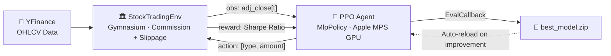
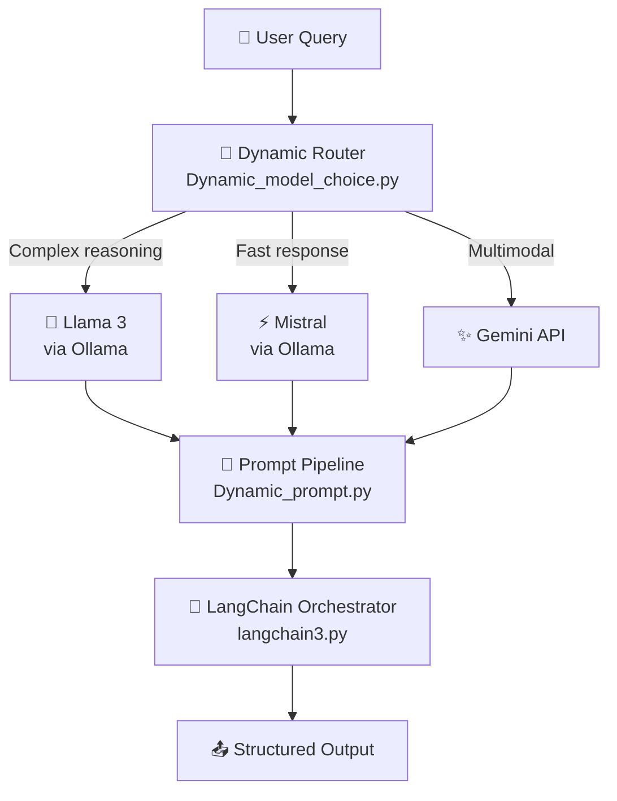
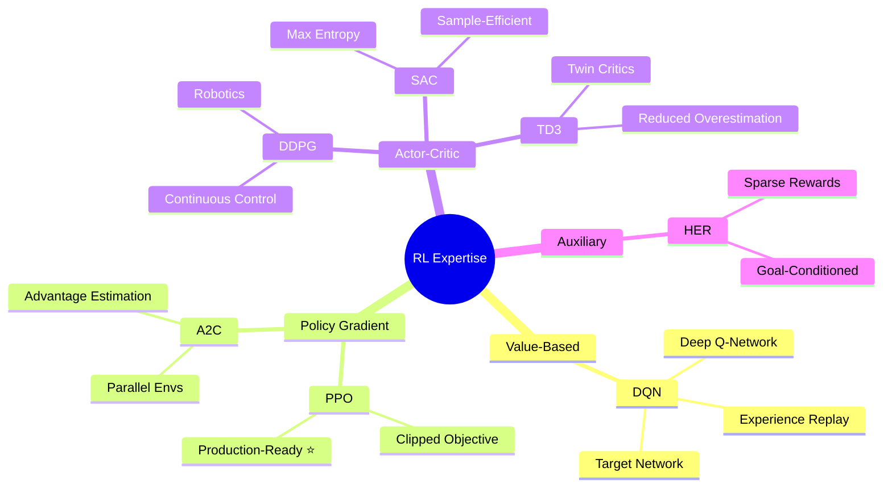
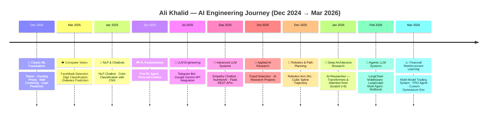

<!-- ═══════════════════════════════════════════════════════════════════════════
     ALI KHALID — GitHub Profile README  ·  Ultra-Advanced Edition
     https://github.com/Alouakhalid
═══════════════════════════════════════════════════════════════════════════════ -->

<div align="center">


<!-- Animated name header -->
<a href="https://github.com/Alouakhalid">
  
</a>

<a href="https://github.com/Alouakhalid">
  
</a>

<br/>

<!-- Social badges -->
[](https://www.linkedin.com/in/ali-khalid-ali-khalid-85468225b/)
[](https://github.com/Alouakhalid)
[](https://github.com/Alouakhalid)
[](https://github.com/Alouakhalid?tab=repositories)

</div>

<br/>

<!-- ─── ABOUT ─────────────────────────────────────────────────────────────── -->
## 🧭 About Me

> *"Bridge mathematics → architecture → deployment. Don't just use models. Understand, modify, and design them."*

I'm an **AI Engineer & Deep Learning Researcher** building end-to-end intelligent systems from first principles to production. My work spans **reinforcement learning**, **large language models**, **computer vision**, and **financial AI** — with a philosophy rooted in mathematical depth rather than surface-level API usage.

```python
class AliKhalid:
    name       = "Ali Khalid"
    role       = "AI Engineer & Deep Learning Researcher"
    location   = "Egypt 🇪🇬"

    expertise  = {
        "core"       : ["Reinforcement Learning", "Deep Learning", "LLM Engineering", "FinTech AI"],
        "languages"  : ["Python ★★★★★", "C++ ★★★☆☆", "JavaScript ★★★☆☆", "MATLAB ★★★☆☆"],
        "frameworks" : ["PyTorch", "TensorFlow/Keras", "Stable-Baselines3", "LangChain", "HuggingFace"],
    }

    current    = [
        "🤖  PPO trading agent — custom Gymnasium env with Sharpe-ratio reward",
        "🔬  Transformer attention from mathematical first principles",
        "🦾  LangGraph multi-agent orchestration systems",
    ]

    philosophy = "Bridge mathematics → architecture → deployment"
    open_to    = ["Research collaborations", "Freelance AI projects", "Open-source contributions"]

    def say_hi(self):
        print("Thanks for visiting! Let's build something intelligent together. 🚀")
```

<br/>

<!-- ─── QUICK NAV ──────────────────────────────────────────────────────────── -->
## 📌 Quick Navigation

<div align="center">

| | Section | Jump |
|:---:|:---|:---|
| 🔥 | **Featured Projects** | [RL Trading Bot](#-1-rl-stock-trading-agent--flagship) · [AI Researcher](#-2-ai-researcher) · [LangChain/Graph](#-3-langchain--langgraph-middleware) · [Multi-Model Trading](#-4-multi-model-trading-system) |
| 🧠 | **Skills** | [RL Algorithms](#-reinforcement-learning-algorithms) · [Classic ML](#-classic-machine-learning) · [Deep Learning](#-deep-learning--neural-architectures) · [Pretrained Models](#-hugging-face--pretrained-models) · [LLM Stack](#-llm--agentic-ai-stack) |
| 📊 | **Stats** | [GitHub Stats](#-github-stats) · [Streak](#-github-stats) · [Timeline](#-learning-journey--timeline) |
| 🎯 | **Now** | [Current Focus](#-current-focus) |

</div>

<br/>

<!-- ─── FEATURED PROJECTS ──────────────────────────────────────────────────── -->
## 🔥 Featured Projects

---

### 🤖 1. RL Stock Trading Agent — *Flagship*

> **Production-grade Deep Reinforcement Learning** for autonomous stock trading with realistic market microstructure.

<table>
<tr>
  <td><b>🔗 Repository</b></td>
  <td><a href="https://github.com/Alouakhalid/Trading_bot_Reinforcment"><code>Trading_bot_Reinforcment</code></a></td>
</tr>
<tr>
  <td><b>📦 Stack</b></td>
  <td><code>Stable-Baselines3</code> · <code>Gymnasium</code> · <code>PyBroker</code> · <code>YFinance</code> · <code>Apple MPS GPU</code></td>
</tr>
<tr>
  <td><b>🎯 Reward Signal</b></td>
  <td>Sharpe Ratio (risk-adjusted returns — not raw P&L)</td>
</tr>
<tr>
  <td><b>📈 Training Result</b></td>
  <td>Episode reward: <code>−1,000 → +1,660</code></td>
</tr>
<tr>
  <td><b>⚙️ Market Model</b></td>
  <td>Commission <code>0.01%</code> + Slippage <code>0.5%</code> (realistic friction)</td>
</tr>
</table>

**Architecture highlights:**

- 🏛️ `StockTradingEnv` — fully custom Gymnasium environment (new 5-tuple API)
- 🧠 `PPO` with `MlpPolicy` — trained on Apple MPS for hardware-accelerated convergence
- 💾 `EvalCallback` + `StopTrainingOnRewardThreshold` — intelligent auto-stop on convergence
- 📁 Best model persisted to `Training/Saved Models/best_model.zip`


```mermaid
flowchart LR
    A["📡 YFinance\nOHLCV Data"] --> B["🏛️ StockTradingEnv\nGymnasium · Commission + Slippage"]
    B -->|"obs: adj_close[t]"| C["🧠 PPO Agent\nMlpPolicy · Apple MPS GPU"]
    C -->|"action: [type, amount]"| B
    B -->|"reward: Sharpe Ratio"| C
    C -->|"EvalCallback"| D["💾 best_model.zip"]
    D -.->|"Auto-reload on improvement"| C
```

---

### 🧠 2. AI Researcher

> ⭐ **6 Stars** — Framework for studying deep learning at full mathematical depth. Zero black boxes.

<table>
<tr>
  <td><b>🔗 Repository</b></td>
  <td><a href="https://github.com/Alouakhalid/AI-Researcher"><code>AI-Researcher</code></a></td>
</tr>
<tr>
  <td><b>📦 Stack</b></td>
  <td><code>PyTorch</code> · <code>NumPy</code> · <code>Matplotlib</code></td>
</tr>
<tr>
  <td><b>⭐ Stars</b></td>
  <td>6</td>
</tr>
</table>

| Notebook | Module | Depth Level |
|:---|:---|:---|
| `Neural_Netwok.ipynb` | Neural Foundations | Biological → Mathematical abstraction |
| `Attention.ipynb` | Attention Mechanisms | Multi-Head Self-Attention **from scratch** |
| `transformation_block.ipynb` | Transformer Architecture | Full encoder/decoder — **no `nn.Transformer`** |
| `math_pyhton.ipynb` | Math Visualizations | Gradients, loss landscapes, activation surfaces |

> *"If you want to use models → elsewhere. If you want to understand, modify, and design models → welcome here."*

---

### 🔗 3. LangChain & LangGraph Middleware

> Advanced LLM middleware pipeline with dynamic model routing, context chaining, and multi-agent graph orchestration.

<table>
<tr>
  <td><b>🔗 Repository</b></td>
  <td><a href="https://github.com/Alouakhalid/langchain-and-langgraphe"><code>langchain-and-langgraphe</code></a></td>
</tr>
<tr>
  <td><b>📦 Stack</b></td>
  <td><code>LangChain</code> · <code>LangGraph</code> · <code>Ollama</code> · <code>Python</code></td>
</tr>
</table>


```mermaid
flowchart TD
    U["👤 User Query"] --> R["🔀 Dynamic Router\nDynamic_model_choice.py"]
    R -->|"Complex reasoning"| L["🦙 Llama 3\nvia Ollama"]
    R -->|"Fast response"| M["⚡ Mistral\nvia Ollama"]
    R -->|"Multimodal"| G["✨ Gemini API"]
    L & M & G --> P["📝 Prompt Pipeline\nDynamic_prompt.py"]
    P --> C["🔗 LangChain Orchestrator\nlangchain3.py"]
    C --> O["📤 Structured Output"]
```

---

### 📊 4. Multi-Model Trading System

> Hybrid quantitative analysis — **Transformer + LSTM + Random Forest** ensemble for market prediction.

<table>
<tr>
  <td><b>🔗 Repository</b></td>
  <td><a href="https://github.com/Alouakhalid/Trading_model"><code>Trading_model</code></a></td>
</tr>
<tr>
  <td><b>📦 Stack</b></td>
  <td><code>PyTorch</code> · <code>Scikit-Learn</code> · <code>Flet Dashboard</code> · <code>Plotly</code></td>
</tr>
</table>

| Model | Role | Input Features |
|:---|:---|:---|
| **Transformer Encoder** | Market regime detection | Multi-Head Attention over OHLCV sequences |
| **LSTM Network** | Price action forecasting | Sequential memory, momentum, temporal patterns |
| **Random Forest (200 trees)** | Buy/Sell signal generation | RSI, MACD, ATR, EMA, SMA technical indicators |
| **Ensemble Layer** | Final decision | Weighted vote across all three models |

---

### 🦿 Notable Projects — Complete Table

<details>
<summary><b>📂 View All 31 Repositories (click to expand)</b></summary>

<br/>

| # | Project | Primary Stack | Description | Stars | Updated |
|:---:|:---|:---|:---|:---:|:---|
| 1 | [Trading_bot_Reinforcment](https://github.com/Alouakhalid/Trading_bot_Reinforcment) | SB3 · Gymnasium | PPO trading agent, custom env | — | Mar 2026 |
| 2 | [Trading_model](https://github.com/Alouakhalid/Trading_model) | PyTorch · Plotly | Transformer+LSTM+RF ensemble | — | Mar 2026 |
| 3 | [Reinforcement_learning_notes-](https://github.com/Alouakhalid/Reinforcement_learning_notes-) | Jupyter | RL study notes | — | Mar 2026 |
| 4 | [Reinforcement_learning_projects_agents](https://github.com/Alouakhalid/Reinforcement_learning_projects_agents) | SB3 · Gymnasium | Multi-domain RL agents | — | Mar 2026 |
| 5 | [AI-Researcher](https://github.com/Alouakhalid/AI-Researcher) | PyTorch · NumPy | Transformers from scratch | ⭐ 6 | Jan 2026 |
| 6 | [langchain-and-langgraphe](https://github.com/Alouakhalid/langchain-and-langgraphe) | LangChain · Ollama | LLM middleware pipeline | — | Feb 2026 |
| 7 | [Moltbook_project](https://github.com/Alouakhalid/Moltbook_project) | HTML · CSS | Full web book platform | ⭐ 1 | Feb 2026 |
| 8 | [Robotics-Arm](https://github.com/Alouakhalid/Robotics-Arm) | Python · NumPy | Inverse kinematics control | — | Dec 2025 |
| 9 | [AI_research_project-](https://github.com/Alouakhalid/AI_research_project-) | Python | Applied AI research | — | Oct 2025 |
| 10 | [Fraud-detection](https://github.com/Alouakhalid/Fraud-detection) | XGBoost · ML | Financial fraud pipeline | — | Oct 2025 |
| 11 | [NutritionAI](https://github.com/Alouakhalid/NutritionAI) | HTML · JS | AI nutrition advisor | ⭐ 1 | Sep 2025 |
| 12 | [Empathy-chatbot](https://github.com/Alouakhalid/Empathy-chatbot) | Python · NLP | Emotion-aware chatbot | — | Sep 2025 |
| 13 | [flask](https://github.com/Alouakhalid/flask) | Python · Flask | REST API service | — | Sep 2025 |
| 14 | [bot](https://github.com/Alouakhalid/bot) | Python | Automation bot | — | Jul 2025 |
| 15 | [bot_telegram](https://github.com/Alouakhalid/bot_telegram) | Python | Telegram bot | — | Jul 2025 |
| 16 | [Reinforcement-Learning-Agent-](https://github.com/Alouakhalid/Reinforcement-Learning-Agent-) | Python | First RL agent | — | Jun 2025 |
| 17 | [personal_chatbot](https://github.com/Alouakhalid/personal_chatbot) | Python | Personal assistant | — | Jun 2025 |
| 18 | [chatbot-with-api_google](https://github.com/Alouakhalid/chatbot-with-api_google) | Python · Gemini | Google AI chatbot | — | May 2025 |
| 19 | [document-qa](https://github.com/Alouakhalid/document-qa) | LangChain | PDF Q&A system | — | May 2025 |
| 20 | [Digit-classification](https://github.com/Alouakhalid/Digit-classification) | CNN · Keras | MNIST digit recognition | — | May 2025 |
| 21 | [chatbot](https://github.com/Alouakhalid/chatbot) | Jupyter | NLP chatbot | — | Apr 2025 |
| 22 | [color-classification](https://github.com/Alouakhalid/color-classification) | CNN · OpenCV | Color detection CNN | — | Apr 2025 |
| 23 | [FaceMask-Project](https://github.com/Alouakhalid/FaceMask-Project) | CNN · OpenCV | Real-time mask detection | — | Apr 2025 |
| 24 | [Diabetes-](https://github.com/Alouakhalid/Diabetes-) | Scikit-learn | Medical classification | — | Mar 2025 |
| 25 | [Loan-Prediction-](https://github.com/Alouakhalid/Loan-Prediction-) | Ensemble ML | Loan risk prediction | — | Dec 2024 |
| 26 | [cubic-spline-path-of-robot-](https://github.com/Alouakhalid/cubic-spline-path-of-robot-) | Python | Trajectory planning | — | Dec 2024 |
| 27 | [housing_price_prediction](https://github.com/Alouakhalid/housing_price_prediction) | Regression ML | House price prediction | — | Dec 2024 |
| 28 | [Mall-Customers-clustering-](https://github.com/Alouakhalid/Mall-Customers-clustering-) | K-Means | Customer segmentation | — | Dec 2024 |
| 29 | [Titanic-project-](https://github.com/Alouakhalid/Titanic-project-) | Ensemble ML | Survival prediction | ⭐ 1 | Dec 2024 |
| 30 | [Assiuitsheets_new_comer_solutions](https://github.com/Alouakhalid/Assiuitsheets_new_comer_solutions) | C++ | Competitive programming | — | Dec 2025 |

</details>

<br/>

<!-- ─── SKILLS ──────────────────────────────────────────────────────────────── -->
## 🚀 Technical Skills

---

### 🧠 Core AI Domains

<div align="center">


</div>

---

### 💻 Programming Languages

<div align="center">

| Language | Level | Primary Use |
|:---:|:---:|:---|
|  | `★★★★★ Expert` | AI/ML · Automation · APIs · Everything |
|  | `★★★☆☆ Intermediate` | Competitive programming · Performance-critical code |
|  | `★★★☆☆ Proficient` | Web apps · Interactive dashboards |
|  | `★★★☆☆ Proficient` | Frontend · Web projects |
|  | `★★★☆☆ Proficient` | Signal processing · Math visualization |

</div>

---

### 🤖 Reinforcement Learning Algorithms

> Implemented, tuned, and deployed via **Stable-Baselines3** and from mathematical scratch.


```mermaid
mindmap
  root((RL Expertise))
    Value-Based
      DQN
        Deep Q-Network
        Experience Replay
        Target Network
    Policy Gradient
      PPO
        Clipped Objective
        Production-Ready ⭐
      A2C
        Parallel Envs
        Advantage Estimation
    Actor-Critic
      DDPG
        Continuous Control
        Robotics
      TD3
        Twin Critics
        Reduced Overestimation
      SAC
        Max Entropy
        Sample-Efficient
    Auxiliary
      HER
        Sparse Rewards
        Goal-Conditioned
```

| Algorithm | Paradigm | Action Space | Key Strength | Used In |
|:---|:---|:---:|:---|:---|
| **DQN** | Value-Based | Discrete | Atari · discrete control | RL Projects |
| **PPO** ⭐ | Policy Gradient | Both | Stable · sample-efficient · **production** | Trading Bot |
| **A2C** | Actor-Critic | Both | Parallel environment training | RL Projects |
| **DDPG** | Actor-Critic | Continuous | Robotics · continuous control | Robotics Arm |
| **TD3** | Actor-Critic | Continuous | Reduced Q-value overestimation | RL Projects |
| **SAC** | Actor-Critic | Continuous | Maximum entropy · sample-efficient | RL Projects |
| **HER** | Auxiliary | Both | Sparse reward environments | RL Projects |

---

### 🌲 Classic Machine Learning

<details>
<summary><b>📈 Regression Models (13 algorithms)</b></summary>

<br/>

| Model | Library | Regularization | Best For |
|:---|:---|:---:|:---|
| Linear Regression | `scikit-learn` | None | Baseline, interpretability |
| Ridge Regression | `scikit-learn` | L2 | Multicollinearity, stable coefficients |
| Lasso Regression | `scikit-learn` | L1 | Sparse solutions, feature selection |
| ElasticNet | `scikit-learn` | L1+L2 | Combined regularization |
| Polynomial Regression | `scikit-learn` | — | Non-linear relationships |
| SVR | `scikit-learn` | — | Kernel-based, high-dim data |
| Decision Tree Regressor | `scikit-learn` | — | Interpretable, non-linear |
| **Random Forest** ⭐ | `scikit-learn` | Bagging | Robust ensemble predictions |
| Gradient Boosting | `scikit-learn` | Boosting | Sequential error correction |
| **XGBoost** ⭐ | `xgboost` | Boosting | Competition-grade performance |
| LightGBM | `lightgbm` | Boosting | Large-scale, fast training |
| KNN Regressor | `scikit-learn` | — | Non-parametric baseline |
| Bayesian Ridge | `scikit-learn` | Probabilistic | Uncertainty-aware regression |

</details>

<details>
<summary><b>🔍 Classification Models (14 algorithms)</b></summary>

<br/>

| Model | Library | Paradigm | Best For |
|:---|:---|:---:|:---|
| Logistic Regression | `scikit-learn` | Linear | Baseline, interpretable |
| SVC | `scikit-learn` | Kernel | High-dim, margin classification |
| Decision Tree | `scikit-learn` | Tree | Interpretable rules |
| **Random Forest** ⭐ | `scikit-learn` | Bagging | Robust, 200+ trees |
| Gradient Boosting | `scikit-learn` | Boosting | Sequential learners |
| **XGBoost** ⭐ | `xgboost` | Boosting | Competition-grade |
| **LightGBM** ⭐ | `lightgbm` | Boosting | Fast, large-scale |
| AdaBoost | `scikit-learn` | Adaptive | Weak learner combination |
| Naive Bayes | `scikit-learn` | Probabilistic | Text, fast inference |
| KNN | `scikit-learn` | Distance | Non-parametric |
| LDA | `scikit-learn` | Dimensionality | Linear class boundaries |
| QDA | `scikit-learn` | Dimensionality | Non-linear boundaries |
| Extra Trees | `scikit-learn` | Extreme Rand | Fast, decorrelated trees |
| MLP Classifier | `scikit-learn` | Neural | Shallow neural net |

</details>

<details>
<summary><b>🔵 Unsupervised / Clustering (6 algorithms)</b></summary>

<br/>

| Model | Type | Applied In |
|:---|:---:|:---|
| **K-Means** ⭐ | Centroid | Mall customer segmentation |
| DBSCAN | Density | Anomaly/outlier detection |
| Hierarchical / Agglomerative | Tree | Dendrogram-based grouping |
| Gaussian Mixture Models (GMM) | Probabilistic | Soft cluster assignment |
| **PCA** | Reduction | Dimensionality reduction pipeline |
| **t-SNE** | Reduction | High-dimensional visualization |

</details>

---

### ⚡ Deep Learning & Neural Architectures

<div align="center">

[](https://pytorch.org/)
[](https://tensorflow.org/)
[](https://numpy.org/)

</div>

| Architecture | Depth Level | Key Concepts | Applied Projects |
|:---|:---:|:---|:---|
| **Feedforward (MLP)** | ★★★★★ | Backprop, activations, optimizers | Trading, classification |
| **CNN** | ★★★★☆ | Convolution, pooling, BatchNorm | FaceMask, Digit, Color |
| **LSTM / GRU** | ★★★★☆ | Gated memory, time-series | Trading forecasting |
| **Transformer / Attention** | ★★★★☆ | Multi-Head Self-Attention, positional encoding | AI-Researcher, Trading |
| **Hybrid Ensembles** | ★★★★☆ | Deep + classical combination | Multi-Model Trading |
| **Autoencoder** | ★★★☆☆ | Unsupervised representation learning | Anomaly detection |
| **PPO / Actor-Critic nets** | ★★★★★ | Policy + value network architecture | RL Trading Agent |

```python
# Transformer Attention — built from scratch in AI-Researcher
import torch
import torch.nn as nn
import math

class MultiHeadSelfAttention(nn.Module):
    def __init__(self, d_model: int, n_heads: int):
        super().__init__()
        assert d_model % n_heads == 0
        self.d_k     = d_model // n_heads
        self.n_heads = n_heads
        self.W_q = nn.Linear(d_model, d_model)
        self.W_k = nn.Linear(d_model, d_model)
        self.W_v = nn.Linear(d_model, d_model)
        self.W_o = nn.Linear(d_model, d_model)

    def scaled_dot_product(self, Q, K, V, mask=None):
        scores = torch.matmul(Q, K.transpose(-2, -1)) / math.sqrt(self.d_k)
        if mask is not None:
            scores = scores.masked_fill(mask == 0, float('-inf'))
        return torch.matmul(torch.softmax(scores, dim=-1), V)

    def forward(self, x):
        B, T, D = x.shape
        Q = self.W_q(x).view(B, T, self.n_heads, self.d_k).transpose(1, 2)
        K = self.W_k(x).view(B, T, self.n_heads, self.d_k).transpose(1, 2)
        V = self.W_v(x).view(B, T, self.n_heads, self.d_k).transpose(1, 2)
        attn = self.scaled_dot_product(Q, K, V)
        out  = attn.transpose(1, 2).contiguous().view(B, T, D)
        return self.W_o(out)
```

---

### 🤗 Hugging Face & Pretrained Models

<div align="center">

[](https://huggingface.co/)

</div>

<details>
<summary><b>🖼️ Computer Vision — Pretrained Backbone Models</b></summary>

<br/>

| Model | Architecture | Parameters | Specialty |
|:---|:---|:---:|:---|
| **VGG-16** | Very Deep Conv | 138M | Transfer learning baseline |
| **VGG-19** | Very Deep Conv | 143M | Fine-tuning, feature extraction |
| **ResNet-50** | Residual (skip connections) | 25M | ⭐ Widely used transfer learning |
| **ResNet-101 / 152** | Deep Residual | 44M / 60M | High-accuracy recognition |
| **EfficientNet-B0 → B7** | Compound scaling | 5–66M | ⭐ Best accuracy-per-FLOP |
| **MobileNetV2 / V3** | Depthwise separable | 3–5M | Edge, mobile inference |
| **InceptionV3** | Inception modules | 23M | Multi-scale feature capture |
| **DenseNet-121 / 201** | Dense connections | 8–20M | Medical imaging |
| **ViT (Vision Transformer)** | Patch-based Transformer | 86M+ | ⭐ SOTA image classification |
| **CLIP (OpenAI)** | Contrastive vision-language | 400M | Zero-shot classification |
| **DETR** | Detection Transformer | 41M | Anchor-free object detection |

</details>

<details>
<summary><b>📝 NLP & LLM — Pretrained Language Models</b></summary>

<br/>

| Model | Type | Parameters | Key Use Case |
|:---|:---:|:---:|:---|
| **BERT / RoBERTa** | Encoder | 110M–125M | Classification, NER, Q&A |
| **GPT-2** | Decoder | 117M–1.5B | Text generation |
| **DistilBERT** | Distilled Encoder | 66M | Fast inference, mobile NLP |
| **T5 / FLAN-T5** | Enc-Dec | 60M–11B | Summarization, translation |
| **Llama 2 / 3 (Ollama)** | Decoder LLM | 7B–70B | Local chatbot, reasoning |
| **Mistral (Ollama)** | Decoder LLM | 7B | Fast local inference |
| **Gemini API** | Multimodal | — | Google AI integration |

</details>

```python
# Transfer Learning workflow — from AI projects
from torchvision.models import efficientnet_b0, EfficientNet_B0_Weights
import torch.nn as nn

def build_classifier(num_classes: int, freeze_backbone: bool = True):
    backbone = efficientnet_b0(weights=EfficientNet_B0_Weights.IMAGENET1K_V1)

    if freeze_backbone:
        for param in backbone.features.parameters():
            param.requires_grad = False  # Freeze pretrained weights

    in_features = backbone.classifier[1].in_features
    backbone.classifier = nn.Sequential(
        nn.Dropout(p=0.3, inplace=True),
        nn.Linear(in_features, 512),
        nn.ReLU(),
        nn.Dropout(p=0.2),
        nn.Linear(512, num_classes)
    )
    return backbone
```

---

### 🔗 LLM & Agentic AI Stack

<div align="center">

[](https://langchain.com/)
[](https://langgraph.com/)
[](https://ollama.ai/)
[](https://ai.google.dev/)

</div>

| Tool | Capability | Used For |
|:---|:---|:---|
| **LangChain** | Middleware chains, prompt templates, memory, context passing | langchain-and-langgraphe |
| **LangGraph** | Stateful multi-agent graph workflows | Agent orchestration |
| **Ollama** | Local LLM runtime — Llama 3, Mistral, CodeLlama | Private inference |
| **Gemini API** | Google multimodal AI integration | Chatbot · NutritionAI |
| **HuggingFace Transformers** | Model hub, fine-tuning, inference pipelines | NLP downstream tasks |

---

### 📊 Data Science & Visualization Stack

<div align="center">


</div>

| Competency | Detail |
|:---|:---|
| **Feature Engineering** | Rolling statistics, RSI, MACD, ATR, volatility signals, lag features |
| **Data Cleaning** | Missing-value imputation strategies, outlier detection (IQR, Z-score, IsoForest) |
| **Model Evaluation** | CV, confusion matrices, ROC-AUC, Sharpe Ratio, F1, MAE, RMSE |
| **Visualization** | Interactive dashboards (Plotly/Flet), trade charts, loss/reward curves, SHAP plots |

<br/>

<!-- ─── GITHUB STATS ─────────────────────────────────────────────────────────── -->
## 📊 GitHub Stats

<div align="center">


<br/>


<br/>


</div>

<br/>

<!-- ─── TIMELINE ─────────────────────────────────────────────────────────────── -->
## 🗺️ Learning Journey & Timeline


```mermaid
timeline
    title Ali Khalid — AI Engineering Journey (Dec 2024 → Mar 2026)

    Dec 2024 : 🌱 Classic ML Foundations
             : Titanic · Housing Prices · Mall Clustering · Loan Prediction

    Mar 2025 : 👁️ Computer Vision
             : FaceMask Detection · Digit Classification · Diabetes Prediction

    Apr 2025 : 💬 NLP & Chatbots
             : NLP Chatbot · Color Classification with CNN

    Jun 2025 : 🎮 RL Fundamentals
             : First RL Agent · Personal Chatbot

    Jul 2025 : 🤖 LLM Engineering
             : Telegram Bot · Google Gemini API Integration

    Sep 2025 : 🧬 Advanced LLM Systems
             : Empathy Chatbot · NutritionAI · Flask REST APIs

    Oct 2025 : 🔬 Applied AI Research
             : Fraud Detection · AI Research Projects

    Dec 2025 : 🦾 Robotics & Path Planning
             : Robotics Arm (IK) · Cubic Spline Trajectory

    Jan 2026 : 🧠 Deep Architecture Research
             : AI-Researcher — Transformers & Attention from Scratch (⭐6)

    Feb 2026 : 🔗 Agentic LLM Systems
             : LangChain Middleware · LangGraph Multi-Agent · Moltbook

    Mar 2026 : 📈 Financial Reinforcement Learning
             : Multi-Model Trading System · PPO Agent · Custom Gymnasium Env
```

<br/>

<!-- ─── CURRENT FOCUS ────────────────────────────────────────────────────────── -->
## 🎯 Current Focus

```
╔══════════════════════════════════════════════════════════════════════════════╗
║                          CURRENT DEVELOPMENT FOCUS                          ║
╠══════════════════════════════════════════════════════════════════════════════╣
║                                                                              ║
║  🤖  RL Algorithmic Trading                                                  ║
║      ├── Custom Gymnasium envs with realistic market microstructure          ║
║      ├── Sharpe-Ratio reward shaping + risk management constraints           ║
║      └── PPO / SAC training · Apple MPS GPU acceleration                    ║
║                                                                              ║
║  🧠  Deep Learning Architecture Research                                     ║
║      ├── Transformer / Attention from pure mathematical first principles     ║
║      └── Goal: architectural design capability — not just usage              ║
║                                                                              ║
║  🤗  Pretrained Model Fine-tuning                                            ║
║      ├── EfficientNet / ViT transfer learning pipelines                      ║
║      └── HuggingFace downstream task fine-tuning                            ║
║                                                                              ║
║  🔗  Agentic LLM Systems                                                     ║
║      ├── LangChain design patterns for production middleware                 ║
║      └── LangGraph stateful multi-agent orchestration                       ║
║                                                                              ║
╚══════════════════════════════════════════════════════════════════════════════╝
```

<br/>

<!-- ─── FOOTER ────────────────────────────────────────────────────────────────── -->

<div align="center">


---

**Ali Khalid** &nbsp;·&nbsp; AI Engineer & Deep Learning Researcher

[](https://www.linkedin.com/in/ali-khalid-ali-khalid-85468225b/)
&nbsp;
[](https://github.com/Alouakhalid)

<br/>

<sub>⚡ Built with research-grade precision &nbsp;·&nbsp; Updated May 2026 &nbsp;·&nbsp; Open to collaborations</sub>

</div>
